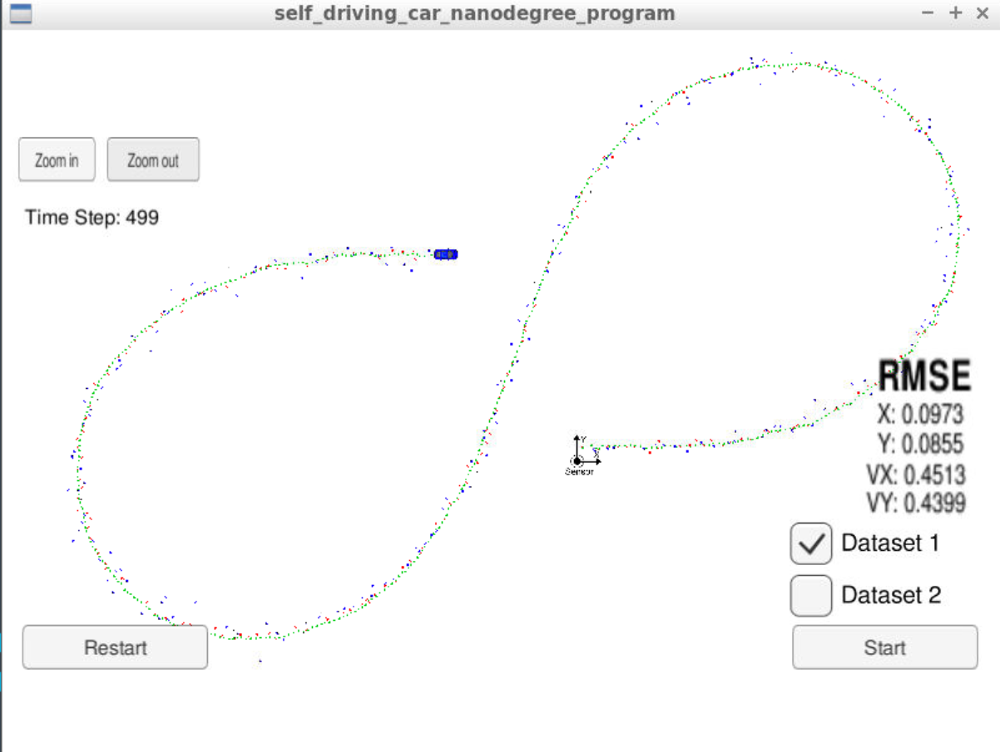

# Extended Kalman Filter Project
Self-Driving Car Engineer Nanodegree Program

For this project I have used a kalman filter (lidar) and an extended kalman filter (radar) to estimate the state of a moving object of interest with noisy measurements. The accuracy of the process has been determined by using a root mean square error evaluation function in the toolset provided.

The output from the simulator on datasets 1 and 2 can be seen below:

Dataset 1 

Dataset 2

Overall the error achieved was less than the suggested one - RMSE <= [.11, .11, 0.52, 0.52]. However, there is still some room for improvement towards ground truth as the linear function implemented for the lidar tended to overestimate the position of the object when the car was going into or coming out of turns. 

Using multiple Kalman filters in this way allows the data from multiple sensors to be fused to provide highly accurate tracking and localisation for multiple objects.